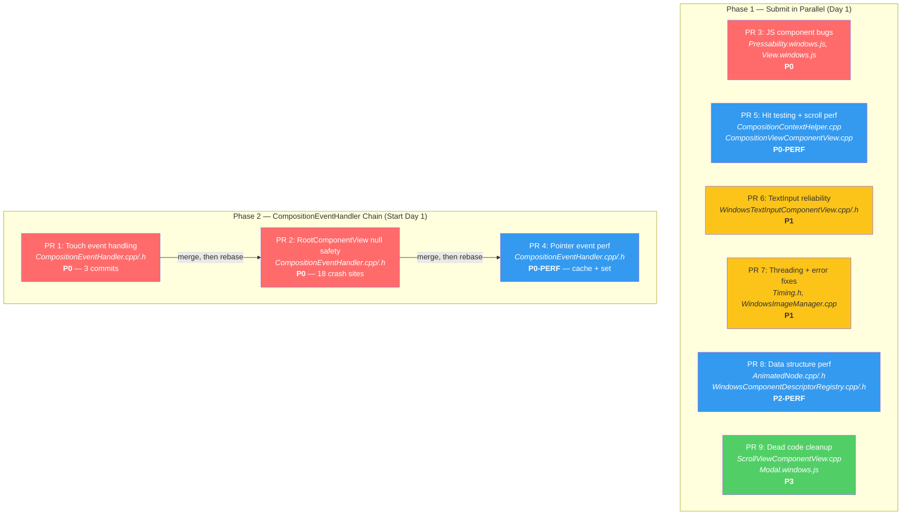

# Merge Plan — React Native Windows Upstream PRs

This document details the exact order to create PRs, when to submit them, when to rebase, and how to manage merge conflicts across the 9 PRs.

---

## Why Order Matters

Three PRs modify `CompositionEventHandler.cpp/.h`. If two of those are open simultaneously and one merges, the other will have merge conflicts. The remaining 6 PRs touch unique files and can be submitted in parallel without conflict.

---

## Conflict Groups

```
Group A — CompositionEventHandler.cpp/.h (3 PRs, must be sequential):
  PR 1 (touch fixes) → PR 2 (null safety) → PR 4 (pointer perf)

Group B — Independent (6 PRs, submit in parallel):
  PR 3, PR 5, PR 6, PR 7, PR 8, PR 9
```

---

## Mermaid Diagram



**Legend:**
- Red = Critical bug fix (P0)
- Blue = Performance improvement (P0-PERF / P2-PERF)
- Yellow = Reliability / safety fix (P1)
- Green = Cleanup (P3)

---

## Detailed Step-by-Step Execution

### Day 1 — Submit Everything You Can

**Step 1: Submit all 6 independent PRs simultaneously**

These touch unique files — no conflict risk:

| PR | Branch | Title |
|----|--------|-------|
| 3 | `fix/js-component-bugs` | Fix Pressability hover timeout and tabIndex focusable mapping on Windows |
| 5 | `perf/hit-testing-and-scroll` | Eliminate O(n²) hit testing and optimize snap scroll configuration |
| 6 | `fix/textinput-reliability` | Improve TextInput reliability: thread-safe loading, null safety, and use-after-free fix |
| 7 | `fix/threading-and-error-handling` | Fix Timing data race and remove duplicate image error allocation |
| 8 | `perf/data-structure-optimizations` | Use unordered_set for animated node and component registry lookups |
| 9 | `chore/dead-code-cleanup` | Clean up dead code in ScrollView and simplify Modal event emitter init |

**Step 2: Submit first PR in the CompositionEventHandler chain**

| PR | Branch | Title |
|----|--------|-------|
| 1 | `fix/touch-event-handling` | Fix touch event handling: device type detection, screenPoint coordinates, and cancel W3C compliance |

---

### Ongoing — As Chain PRs Merge

```
┌─────────────────────────────────────────────────────────────┐
│ CHAIN: PR 1 → PR 2 → PR 4                                  │
│                                                             │
│ After PR 1 merges:                                          │
│   git fetch upstream                                        │
│   git checkout fix/root-component-view-null-safety           │
│   git rebase upstream/main                                  │
│   git push origin fix/root-component-view-null-safety --force-with-lease │
│   → Create upstream PR for PR 2                             │
│                                                             │
│ After PR 2 merges:                                          │
│   git fetch upstream                                        │
│   git checkout perf/pointer-event-handling                  │
│   git rebase upstream/main                                  │
│   git push origin perf/pointer-event-handling --force-with-lease │
│   → Create upstream PR for PR 4                             │
│                                                             │
│ After PR 4 merges:                                          │
│   → All 9 PRs complete!                                     │
└─────────────────────────────────────────────────────────────┘
```

---

## Timeline Estimate

Assuming upstream reviews take 2-5 business days per PR:

| Week | What Happens |
|------|-------------|
| **Week 1** | Submit all 6 independent PRs + PR 1 (chain starter). 7 PRs open for review. |
| **Week 2** | Independent PRs merge. PR 1 merges → submit PR 2. |
| **Week 3** | PR 2 merges → submit PR 4. |
| **Week 4** | PR 4 merges. All 9 PRs complete. |

**Optimistic (fast reviews):** 2-3 weeks  
**Realistic:** 3-4 weeks

---

## Alternative: Submit Chain PRs Early With Dependencies

Submit all 3 CompositionEventHandler PRs at once, noting dependencies:

```markdown
## Dependencies
This PR depends on #XX. Please merge that first.
```

This lets reviewers see the full scope and potentially batch-approve. You'll still need to rebase as each merges, but it parallelizes review time.
